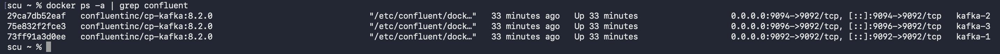
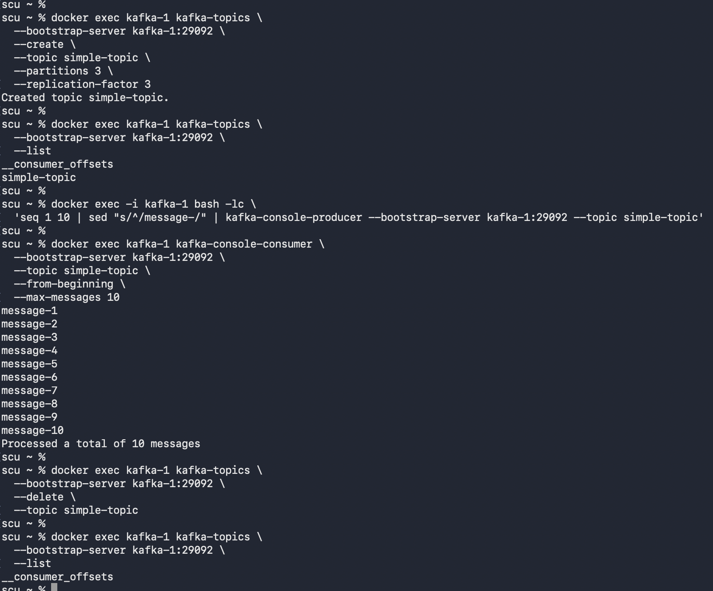
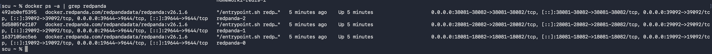
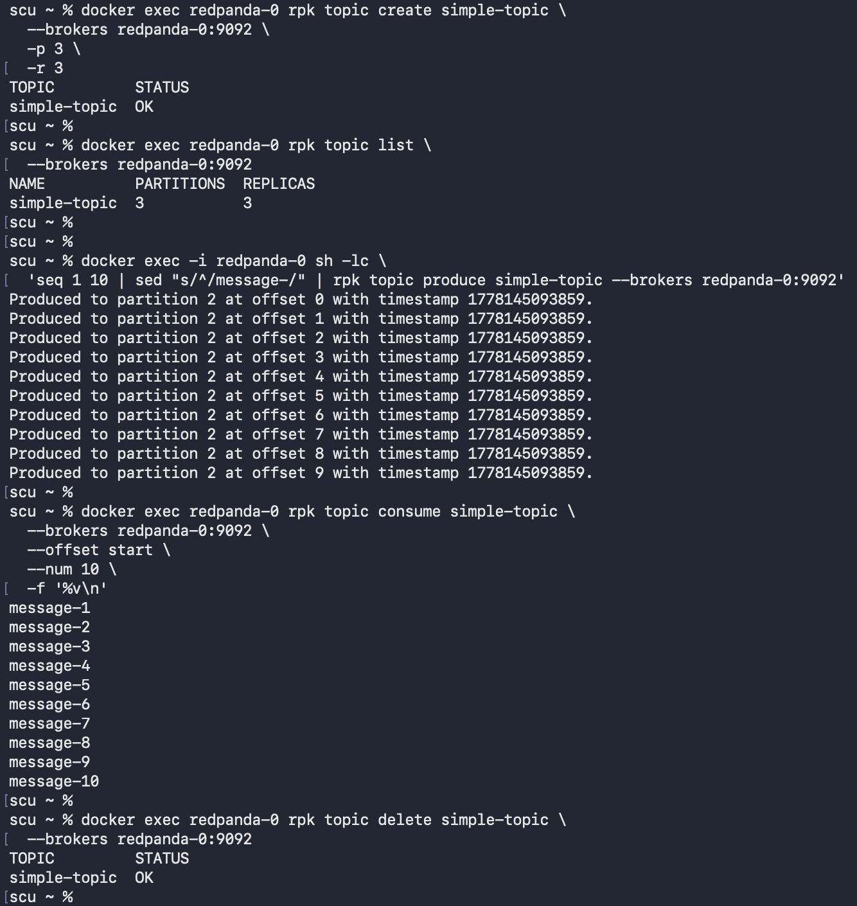

## Kafka

<details>
    <summary>Overview of the commands execution</summary>




</details>

### Run the cluster
```shell
docker-compose -f docker-compose.yml up -d
```

### Create a topic
```shell
docker exec kafka-1 kafka-topics \
  --bootstrap-server kafka-1:29092 \
  --create \
  --topic simple-topic \
  --partitions 3 \
  --replication-factor 3
```

### List topics
```shell
docker exec kafka-1 kafka-topics \
  --bootstrap-server kafka-1:29092 \
  --list
```

### Produce messages
```shell
docker exec -i kafka-1 bash -lc \
  'seq 1 10 | sed "s/^/message-/" | kafka-console-producer --bootstrap-server kafka-1:29092 --topic simple-topic'
```

### Consume messages
```shell
docker exec kafka-1 kafka-console-consumer \
  --bootstrap-server kafka-1:29092 \
  --topic simple-topic \
  --from-beginning \
  --max-messages 10
```

### Delete topic
```shell
docker exec kafka-1 kafka-topics \
  --bootstrap-server kafka-1:29092 \
  --delete \
  --topic simple-topic
```

## Redpanda

<details>
    <summary>Overview of the commands execution</summary>




</details>

### Run the cluster
```shell
docker-compose -f docker-compose-redpanda.yml up -d
```

### Create a topic
```shell
docker exec redpanda-0 rpk topic create simple-topic \
  --brokers redpanda-0:9092 \
  -p 3 \
  -r 3
```

### List topics
```shell
docker exec redpanda-0 rpk topic list \
  --brokers redpanda-0:9092
```

### Produce messages
```shell
docker exec -i redpanda-0 sh -lc \
  'seq 1 10 | sed "s/^/message-/" | rpk topic produce simple-topic --brokers redpanda-0:9092'
```

### Consume messages
```shell
docker exec redpanda-0 rpk topic consume simple-topic \
  --brokers redpanda-0:9092 \
  --offset start \
  --num 10 \
  -f '%v\n'
```

### Delete topic
```shell
docker exec redpanda-0 rpk topic delete simple-topic \
  --brokers redpanda-0:9092
```