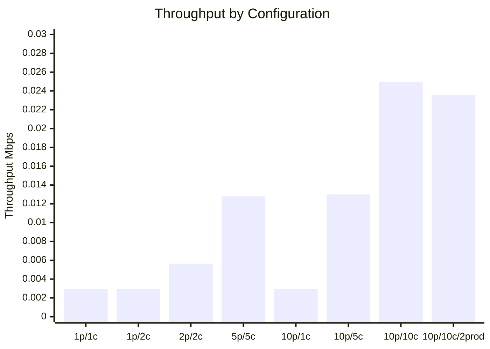
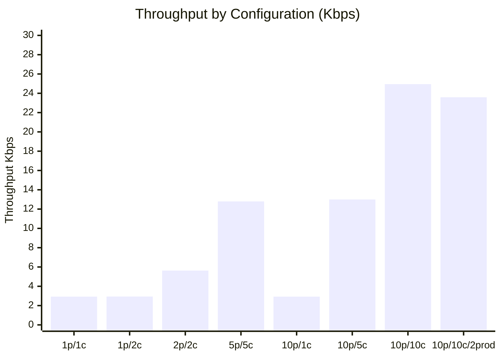
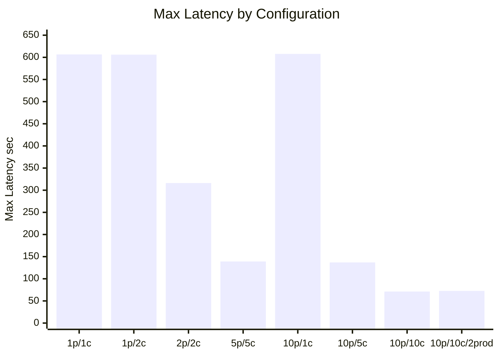

# Homework 2

<details>
<summary>Goals</summary>

1) Learn about implementation of dummy distributed application that uses kafka for communication between components
2) Investigate throughput of a kafka-based solution considering different number of producers, consumers, partitions and replicas
</details>

<details>
<summary>Instructions</summary>

1) Prepare a dataset. You can choose one of the next options<br>
a) a video file with length about 30 minutes<br>
b) reddit dataset of subreddits<br>
c) twitter dataset<br>

2) Prepare a kafka (redpanda) environment.
3) Implement a "generator" microservice that splits the dataset to messages (videoframes, reddit comments), sends them to kafka as a message.
4) Implement a microservice that receive messages (videoframes, reddit comments), imitates processing by sleeping for 1 sec and saves timestamps to a file, e.g. csv.<br>
   a) for the "video" case, consumers should log frame numbers that processed by a consumer<br>
   b) for the "reddit" case, consumers should log a timestamp of a reddit comment that processed by a consumer<br>

5) Implement a microservice that aggregates logs from consumers and generates a report:<br>
   a) throughput of the system in Mbps<br>
   b) latency of message processing: max time processing that includes period of time between the message sending time and finishing time of message processing.<br>
6) Do experiments with different configuration of producers, consumers and topics<br>
   a) One producer, a topic with one partition, one consumer<br>
   b) One producer, a topic with one partition, 2 consumers<br>
   c) One producer, a topic with 2 partitions, 2 consumers<br>
   d) One producer, a topic with 5 partitions, 5 consumers<br>
   e) One producer, a topic with 10 partitions, 1 consumers<br>
   f) One producer, a topic with 10 partitions, 5 consumers<br>
   g) One producer, a topic with 10 partitions, 10 consumers<br>
   h) 2 producers (input data should be split into 2 parts somehow), a topic with 10 partitions, 10 consumers
</details>


## Results
### Comparison table
<details>
<summary>Expand</summary>
Messages: 600<br>
Payload size: 222,623 bytes

| Setup                                    | Duration sec | Throughput Mbps | Throughput Kbps | Max latency sec | Evaluation                                                                                                             |
|------------------------------------------|-------------:|----------------:|----------------:|----------------:|------------------------------------------------------------------------------------------------------------------------|
| 1 partition, 1 consumer                  |      607.916 |        0.002930 |           2.930 |         606.603 | Baseline.                                                                                                              |
| 1 partition, 2 consumers                 |      606.346 |        0.002937 |           2.937 |         606.067 | Same as baseline. The second consumer is idle because one partition can be assigned to only one consumer in the group. |
| 2 partitions, 2 consumers                |      316.312 |        0.005630 |           5.630 |         316.144 | Roughly 2x faster than baseline. Scaling is effective once partitions allow parallel consumers.                        |
| 5 partitions, 5 consumers                |      139.228 |        0.012792 |          12.792 |         139.130 | Roughly 4.4x faster than baseline.                                                                                     |
| 10 partitions, 1 consumer                |      607.866 |        0.002930 |           2.930 |         607.774 | Same as baseline. One consumer processes all messages.                                                                 |
| 10 partitions, 5 consumers               |      137.053 |        0.012995 |          12.995 |         136.938 | Similar to experiment d because both effectively use 5 active consumers.                                               |
| 10 partitions, 10 consumers              |       71.385 |        0.024949 |          24.949 |          71.237 | Roughly 8.5x faster than baseline, close to expected 10-consumer scaling.                                              |
| 10 partitions, 10 consumers, 2 producers |       75.489 |        0.023593 |          23.593 |          72.659 | Similar to experiment g. Two producers do not improve much because processing is consumer-bound.                       |

</details>

### Graphs

Legend:
- `p` = partitions
- `c` = consumers
- `prod` = producers

<details>
<summary>Throughput</summary>

<details>
    <summary>Mbps</summary>



</details>

<details>
    <summary>Kbps</summary>



</details>

</details>

<details>
<summary>Latency</summary>


</details>


## Project Structure

- `csv-producer` - REST API that streams CSV from URL and publishes Kafka messages.
- `message-consumer` - Kafka consumer that sleeps for 1 second and writes processing logs.
- `reporting` - batch-style service that reads shared logs and generates a summary report.

## CSV Producer API

Endpoint:

- `POST /api/v1/experiments`

Sample request:

```json
{
  "experimentName": "h",
  "csvUrl": "https://example.com/reddit_comments.csv",
  "runId": "20260507T113000Z",
  "shardIndex": 0,
  "shardCount": 2
}
```

Notes:

- `runId` optional; generated when missing.
- `shardIndex` optional (default `0`).
- `shardCount` optional (default `1`).
- For experiment `h` needs two producer instances with same `runId` and `shardCount=2`, using shard indexes `0` and `1`.

## Message Contract

Produced Kafka JSON payload:

```json
{
  "messageId": "uuid",
  "runId": "20260507T113000Z",
  "producerId": "csv-producer-1",
  "shardIndex": 0,
  "shardCount": 2,
  "experimentName": "h",
  "sentAtMs": 1778153400123,
  "payloadSizeBytes": 142,
  "payload": "{\"id\":\"...\",\"body\":\"...\"}"
}
```

## Consumer Logs

Each consumer instance writes:

- `logs/<topic>/<run_id>/consumer-<consumer_id>.csv`

CSV columns:

```text
message_id,topic,run_id,partition,offset,consumer_id,sent_at_ms,processed_at_ms,payload_size_bytes
```

<details>
<summary>Example after running experiments</summary>

```text
/logs
├── hw2-exp-a
│         └── run-a-001
│             └── consumer-59fced4a710b.csv
├── hw2-exp-b
│         └── run-b-001
│             └── consumer-961208c9d775.csv
├── hw2-exp-c
│         └── run-c-001
│             ├── consumer-7affac7b5eb4.csv
│             └── consumer-ac42b10f44f8.csv
├── hw2-exp-d
│         └── run-d-001
│             ├── consumer-46de076e5415.csv
│             ├── consumer-4c16a0e9489e.csv
│             ├── consumer-adb5179a1fa0.csv
│             ├── consumer-b776f77af4ea.csv
│             └── consumer-eb5dece67110.csv
├── hw2-exp-e
│         └── run-e-001
│             └── consumer-b26684ab71e8.csv
├── hw2-exp-f
│         └── run-f-001
│             ├── consumer-3a4f319129dc.csv
│             ├── consumer-3d736e5dbaf1.csv
│             ├── consumer-81a6c24b1c74.csv
│             ├── consumer-8233a1fdc4b2.csv
│             └── consumer-ade13fc2718e.csv
├── hw2-exp-g
│         └── run-g-001
│             ├── consumer-108760f4b859.csv
│             ├── consumer-19438ed65891.csv
│             ├── consumer-27cad95044c2.csv
│             ├── consumer-4a651b30446c.csv
│             ├── consumer-4dba6c980500.csv
│             ├── consumer-74c3d80562dd.csv
│             ├── consumer-920ddbe8d5b0.csv
│             ├── consumer-e700c984c30a.csv
│             ├── consumer-f809c30df924.csv
│             └── consumer-fbc6bf1edccb.csv
└── hw2-exp-h
    └── run-h-001
        ├── consumer-34817f28aa85.csv
        ├── consumer-369e46b2ede3.csv
        ├── consumer-587e54462635.csv
        ├── consumer-786e13369496.csv
        ├── consumer-7da15386a4c8.csv
        ├── consumer-8cdb5b92ca5a.csv
        ├── consumer-9ccf1fb69af7.csv
        ├── consumer-ab1c54085c6e.csv
        ├── consumer-ca81b3f4e593.csv
        └── consumer-ddf80d9fc471.csv
```

</details>

## Reporting API

Generate report:
```bash
curl -X POST http://localhost:8083/api/v1/reports/generate
```

Behavior:

- calculates report rows from consumer logs
- logs summary rows to reporting service logs
- writes `summary.csv` to reports folder
- returns report rows in API response

Summary columns:

```text
topic,run_id,messages_unique,total_payload_bytes,duration_sec,throughput_mbps,max_latency_ms
```

## Experiments

All commands should be run from the Homework2 directory.
Please make sure that JAVA_HOME is set to a Java 25 installation or use SDKMAN! (config included).

### Build
Build local Docker images used by Compose:

```bash
./scripts/build-images-local.sh
```

### Docker Compose

1. Start Kafka cluster and prepare topics:

```bash
# Start Kafka cluster
docker compose -f docker-compose-kafka.yml up -d

# Verify the cluster is running
docker compose -f docker-compose-kafka.yml exec kafka-1 kafka-metadata-quorum --bootstrap-server kafka-1:29092 describe --status
```

Create topics for each experiment:
```bash
docker compose -f docker-compose-kafka.yml exec kafka-1 kafka-topics --bootstrap-server kafka-1:29092 --create --if-not-exists --topic hw2-exp-a --partitions 1 --replication-factor 3
docker compose -f docker-compose-kafka.yml exec kafka-1 kafka-topics --bootstrap-server kafka-1:29092 --create --if-not-exists --topic hw2-exp-b --partitions 1 --replication-factor 3
docker compose -f docker-compose-kafka.yml exec kafka-1 kafka-topics --bootstrap-server kafka-1:29092 --create --if-not-exists --topic hw2-exp-c --partitions 2 --replication-factor 3
docker compose -f docker-compose-kafka.yml exec kafka-1 kafka-topics --bootstrap-server kafka-1:29092 --create --if-not-exists --topic hw2-exp-d --partitions 5 --replication-factor 3
docker compose -f docker-compose-kafka.yml exec kafka-1 kafka-topics --bootstrap-server kafka-1:29092 --create --if-not-exists --topic hw2-exp-e --partitions 10 --replication-factor 3
docker compose -f docker-compose-kafka.yml exec kafka-1 kafka-topics --bootstrap-server kafka-1:29092 --create --if-not-exists --topic hw2-exp-f --partitions 10 --replication-factor 3
docker compose -f docker-compose-kafka.yml exec kafka-1 kafka-topics --bootstrap-server kafka-1:29092 --create --if-not-exists --topic hw2-exp-g --partitions 10 --replication-factor 3
docker compose -f docker-compose-kafka.yml exec kafka-1 kafka-topics --bootstrap-server kafka-1:29092 --create --if-not-exists --topic hw2-exp-h --partitions 10 --replication-factor 3
```

2. Start application services:

Depends on an experiment, but in general:
```bash
docker compose -f docker-compose-app.yml up -d --scale message-consumer=1
```

Notes:
- `csv-producer-1` and `csv-producer-2` are both available for experiment `h` and exposed on `http://localhost:8081` and `http://localhost:8082`.
- Consumer and reporting share Docker volumes for logs and reports.
- Reporting API is exposed on `http://localhost:8083`.
- To isolate one experiment from another set a consumer topic during a run: `TOPIC_PATTERN=hw2-exp-a docker compose -f docker-compose-app.yml up -d --scale message-consumer=1`.


### Init
Assumptions:

- `csv-producer-1` is available on `http://localhost:8081`
- `csv-producer-2` is available on `http://localhost:8082`

```bash
CSV_URL="https://raw.githubusercontent.com/ViktorNovyk/DataStreamingWithKafka/refs/heads/main/Homework2/entertainment_movies_600.csv"
P1="http://localhost:8081/api/v1/experiments"
P2="http://localhost:8082/api/v1/experiments"
```

<details>
<summary>The execution flow</summary>

- Run producers\consumers according to the experiment configuration.
```shell
TOPIC_PATTERN=hw2-exp-X docker compose -f docker-compose-app.yml up -d --scale message-consumer=Y
```
- Check the consumer subscriptions in the Kafka cluster.
```shell
docker compose -f docker-compose-kafka.yml exec kafka-1 \
  kafka-consumer-groups --bootstrap-server kafka-1:29092 \
  --describe --group hw2-consumers
```
- Call producer(s) according to the experiment configuration.
```bash
curl -X POST "$P1" -H "Content-Type: application/json" \
  -d '{"experimentName":"X","csvUrl":"'"$CSV_URL"'","runId":"run-X-001"}'
```
- Trigger report generation to observe the progress and get the overall results.
```bash
curl -X POST http://localhost:8083/api/v1/reports/generate
```
- Read summarry report from `reports/summary.csv`.
```bash
docker run --rm \
  -v homework2_shared-reports:/shared/reports \
  alpine sh -c 'apk add --no-cache util-linux >/dev/null && column -s, -t < /shared/reports/summary.csv' 
```

</details>

### Run Experiments

<details>
<summary>One producer, a topic with one partition, one consumer</summary>

Run apps:
```shell
TOPIC_PATTERN=hw2-exp-a docker compose -f docker-compose-app.yml up -d --scale message-consumer=1
```

Run producer:
```bash
curl -X POST "$P1" -H "Content-Type: application/json" \
  -d '{"experimentName":"a","csvUrl":"'"$CSV_URL"'","runId":"run-a-001"}'
```
</details>

<details>
<summary>One producer, a topic with one partition, 2 consumers</summary>

Run apps:
```shell
TOPIC_PATTERN=hw2-exp-b docker compose -f docker-compose-app.yml up -d --scale message-consumer=2
```

Run producer:
```bash
curl -X POST "$P1" -H "Content-Type: application/json" \
  -d '{"experimentName":"b","csvUrl":"'"$CSV_URL"'","runId":"run-b-001"}'
```
</details>

<details>
<summary>One producer, a topic with 2 partitions, 2 consumers</summary>

Run apps:
```shell
TOPIC_PATTERN=hw2-exp-c docker compose -f docker-compose-app.yml up -d --scale message-consumer=2
```

Run producer:
```bash
curl -X POST "$P1" -H "Content-Type: application/json" \
  -d '{"experimentName":"c","csvUrl":"'"$CSV_URL"'","runId":"run-c-001"}'
```
</details>

<details>
<summary>One producer, a topic with 5 partitions, 5 consumers</summary>

Run apps:
```shell
TOPIC_PATTERN=hw2-exp-d docker compose -f docker-compose-app.yml up -d --scale message-consumer=5
```

Run producer:
```bash
curl -X POST "$P1" -H "Content-Type: application/json" \
  -d '{"experimentName":"d","csvUrl":"'"$CSV_URL"'","runId":"run-d-001"}'
```
</details>

<details>
<summary>One producer, a topic with 10 partitions, 1 consumers</summary>

Run apps:
```shell
TOPIC_PATTERN=hw2-exp-e docker compose -f docker-compose-app.yml up -d --scale message-consumer=1
```

Run producer:
```bash
curl -X POST "$P1" -H "Content-Type: application/json" \
  -d '{"experimentName":"e","csvUrl":"'"$CSV_URL"'","runId":"run-e-001"}'
```
</details>

<details>
<summary>One producer, a topic with 10 partitions, 5 consumers</summary>

Run apps:
```shell
TOPIC_PATTERN=hw2-exp-f docker compose -f docker-compose-app.yml up -d --scale message-consumer=5
```

Run producer:
```bash
curl -X POST "$P1" -H "Content-Type: application/json" \
  -d '{"experimentName":"f","csvUrl":"'"$CSV_URL"'","runId":"run-f-001"}'
```
</details>

<details>
<summary>One producer, a topic with 10 partitions, 10 consumers</summary>

Run apps:
```shell
TOPIC_PATTERN=hw2-exp-g docker compose -f docker-compose-app.yml up -d --scale message-consumer=10
```

Run producer:
```bash
curl -X POST "$P1" -H "Content-Type: application/json" \
  -d '{"experimentName":"g","csvUrl":"'"$CSV_URL"'","runId":"run-g-001"}'
```
</details>

<details>
<summary>2 producers (input data should be split into 2 parts somehow), a topic with 10 partitions, 10 consumers</summary>

Run apps:
```shell
TOPIC_PATTERN=hw2-exp-h docker compose -f docker-compose-app.yml up -d --scale message-consumer=10
```

Run producer:
```bash
RUN_ID_H="run-h-001"

curl -X POST "$P1" -H "Content-Type: application/json" \
  -d '{"experimentName":"h","csvUrl":"'"$CSV_URL"'","runId":"'"$RUN_ID_H"'","shardIndex":0,"shardCount":2}' &

curl -X POST "$P2" -H "Content-Type: application/json" \
  -d '{"experimentName":"h","csvUrl":"'"$CSV_URL"'","runId":"'"$RUN_ID_H"'","shardIndex":1,"shardCount":2}' &

wait
```
</details>