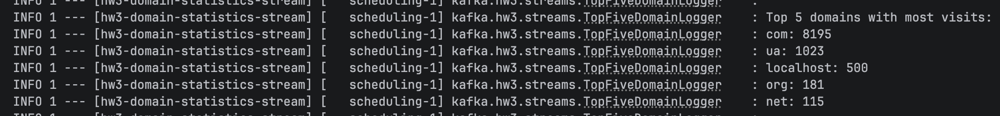

# Homework 3

<details>
<summary>Goals</summary>

1) Learn about implementation of a simple kafka streaming application
</details>

<details>
<summary>Instructions</summary>
1) Prepare a dataset: export a history from your favorite browser to a CSV file<br>
2) Prepare a kafka (redpanda) environment.<br>
3) Implement a "generator" microservice that splits the dataset to messages, sends them to kafka as a message.<br>
4) Implement a kafka streaming application that calculates a visiting statistic - a number of visits for each root domain (com, ua, org, edu, etc)
   from your browser history and prints top five root domains
</details>

## Results
<details>
<summary>Click to see the results</summary>


</details>

## Modules

- `csv-producer` - HTTP API for uploading a CSV file and publishing rows to Kafka.
- `domain-statistics-stream` - Kafka Streams app that aggregates visits by top-level domain and logs top 5.

## Topic

Input topic:

```text
browser-history-visits
```

Aggregation is materialized in a Kafka Streams state store:

```text
top-level-domain-counts-store
```

## Build

Build local Docker images:

```bash
cd Homework3
./scripts/build-images-local.sh
```

## Run

Start Kafka and the apps:

```bash
docker compose -f docker-compose-kafka.yml up -d
docker compose -f docker-compose-kafka.yml exec kafka-1 kafka-topics --bootstrap-server kafka-1:29092 --create --if-not-exists --topic browser-history-visits --partitions 1 --replication-factor 1
```

```bash
docker compose -f docker-compose-app.yml up -d
```

Upload a CSV file:

```bash
curl -F "file=@browser_history.csv" http://localhost:8081/api/v1/history/upload
```

Example response:

```json
{
  "topic": "browser-history-visits",
  "producedMessages": 3,
  "status": "COMPLETED"
}
```

Watch the stream logs:

```bash
docker logs -f hw3-domain-statistics-stream
```

Expected log format:

```text
Top 5 domains with most visits:
com: 8195
ua: 1023
localhost: 500
org: 181
net: 115
```

## How to export a browser history
I use Chrome and MacOS.
```shell
tmp="$(mktemp /tmp/chrome-history.XXXXXX.db)" && \
cp "$HOME/Library/Application Support/Google/Chrome/Default/History" "$tmp" && \
sqlite3 "$tmp" \
-cmd ".mode csv" \
-cmd ".headers on" \
"SELECT url, visit_count FROM urls;" \
> ~/Documents/history_urls.csv && \
rm -f "$tmp"
```