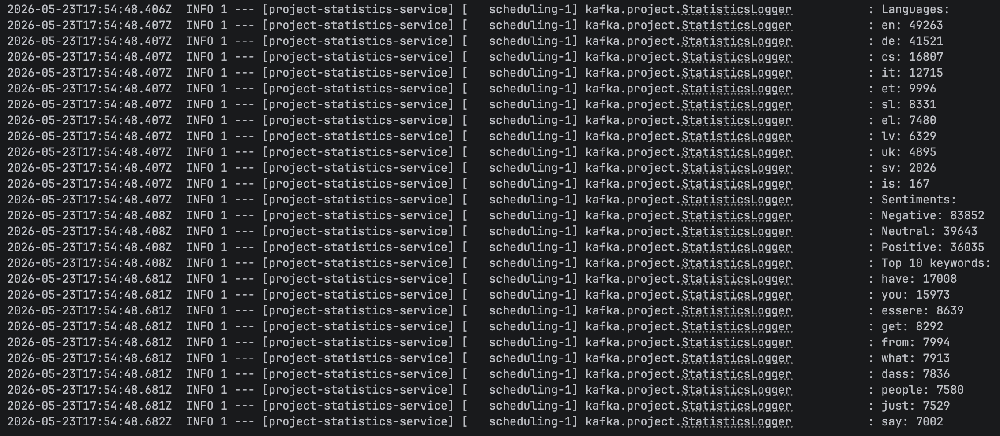
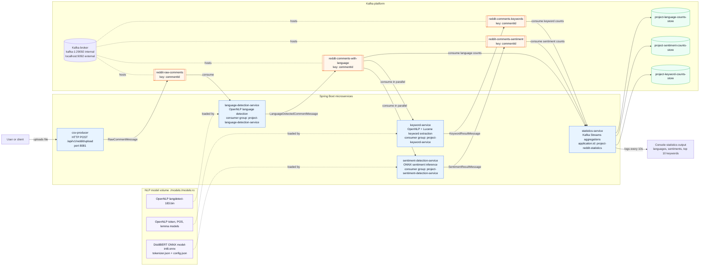

# Reddit Kafka Pipeline Report

<details>
<summary>Task</summary>


Topic: E2E data processing pipeline - processing social media data (Reddit)

Goals: Learn about implementation of E2E data processing pipelines using Kafka for processing social media data from Reddit.

Instructions:

- Prepare a dataset - Reddit dataset of subreddits.
- Prepare a Kafka environment.
- Implement a generator microservice that splits the dataset into Reddit comment messages and sends them to Kafka.
- Implement a microservice that detects the language of a message.
- Implement a microservice that recognizes the sentiment class of a message.
- Sentiment classes: `Negative`, `Positive`.
- Implement a microservice that generates a keyword list for a message.
- Implement a microservice that generates and displays statistics:
    - list of languages with numbers of messages
    - number of messages among sentiment classes
    - top 10 keywords

</details>

## Result

The implemented solution processes Reddit comments through Kafka topics and produces aggregated statistics for detected languages, sentiment classes, and extracted keywords.

[Dataset](https://huggingface.co/datasets/lang-uk/Reddit-MultiGEC)

```text
Languages:
en: 49263
de: 41521
cs: 16807
it: 12715
et: 9996
sl: 8331
el: 7480
lv: 6329
uk: 4895
sv: 2026
is: 167

Sentiments:
Negative: 83852
Neutral: 39643
Positive: 36035

Top 10 keywords:
have: 17008
you: 15973
essere: 8639
get: 8292
from: 7994
what: 7913
dass: 7836
people: 7580
just: 7529
say: 7002
```

<details>
<summary>Screenshot</summary>



</details>

## Notes

### Pipeline Shape

The solution uses a sequential first stage followed by parallel processing:

```text
csv-producer
  -> (topic) reddit-raw-comments
  -> language-detection-service
  -> (topic) reddit-comments-with-language
     -> sentiment-detection-service -> (topic) reddit-comments-sentiment
     -> keyword-service             -> (topic) reddit-comments-keywords
     -> statistics-service
```

Language detection is placed before sentiment and keyword extraction because the detected language is useful downstream. The language-enriched message keeps the original text and adds `language` plus confidence metadata, so the sentiment and keyword services can process the message independently without joining multiple Kafka topics.

Sentiment detection and keyword extraction run in parallel after language detection because neither result depends on the other. This keeps latency lower than a fully sequential pipeline and makes the services easier to scale independently. For example, ONNX sentiment inference is CPU-heavy, while keyword extraction depends on OpenNLP tokenization and lemmatization.

### Service Details

> **Language service**
>
> The `language-detection-service` is the first enrichment step. It consumes raw Reddit comments, detects the language with OpenNLP, and publishes a message that keeps the original text together with the detected `language` and confidence metadata. This makes the detected language available to all downstream services through one Kafka topic: `reddit-comments-with-language`.
>
> The service also limits language detection to the languages expected in the dataset. This avoids producing unsupported language codes for downstream components and makes the statistics output easier to interpret.

> **Sentiment service**
>
> The current `sentiment-detection-service` uses a multilingual ML model, which keeps the architecture simple because one model can process all detected languages. At the same time, the language-first design leaves room for improvement: the sentiment service can choose a language-specific model based on the detected `language` field. That would allow better sentiment quality for languages where a specialized model outperforms the generic multilingual model.
>
> By default, the ML model produces three sentiment classes: `Positive`, `Negative`, and `Neutral`. If the project needs binary sentiment only, the `SENTIMENT_COLLAPSE_NEUTRAL_TO_BINARY` parameter can be enabled. In that mode, neutral predictions are collapsed into either `Positive` or `Negative` based on which of those two classes has the higher score.

> **Keyword service**
>
> The `keyword-service` consumes the same language-enriched comments as the sentiment service. It uses the detected language to select OpenNLP tokenizer, POS, and lemmatizer models when they are available. This keeps keyword extraction language-aware without requiring a separate join with the raw comment stream.
>
> If a language-specific OpenNLP model is missing, the service can still continue with fallback behavior, such as simple tokenization or normalized tokens. Stop words are filtered with Lucene stop-word sets where supported, so common words are removed before keyword statistics are computed.

> **Statistics service**
>
> The `statistics-service` uses Kafka Streams and consumes the language, sentiment, and keyword topics separately. This matches the result requirements because languages, sentiments, and keywords are independent aggregations over the event stream.
>
> Kafka Streams materialized stores keep the language counts, sentiment counts, and keyword counts updated as new messages arrive. The service periodically logs the current statistics, including language totals, sentiment totals, and the top keywords.

### Kafka Convention

All Kafka messages use `commentId` as the key. This keeps records for the same Reddit comment consistently identifiable across topics and makes the message flow easier to inspect and debug.

## Architecture



### Flow Summary

1. `csv-producer` accepts a Reddit CSV upload and publishes one `RawCommentMessage` per comment to `reddit-raw-comments`.
2. `language-detection-service` consumes raw comments, detects language with OpenNLP, and emits enriched comments to `reddit-comments-with-language`.
3. `sentiment-detection-service` and `keyword-service` both consume `reddit-comments-with-language` independently, so sentiment and keyword extraction run in parallel after language detection.
4. `statistics-service` uses Kafka Streams to consume the language, sentiment, and keyword topics, materialize count stores, and log language counts, sentiment counts, and the top keywords.

### Runtime Components

| Component | Role |
| --- | --- |
| `kafka` | Single-node Kafka broker and controller in KRaft mode. |
| `csv-producer` | Upload API and Kafka producer for raw Reddit comments. |
| `language-detection-service` | Kafka consumer/producer that enriches comments with language and confidence. |
| `sentiment-detection-service` | Kafka consumer/producer that emits sentiment class and scores. |
| `keyword-service` | Kafka consumer/producer that emits extracted keyword lists. |
| `statistics-service` | Kafka Streams app that computes aggregate statistics. |

## Build and run the project

This guide describes how to prepare the NLP model files and build the local Docker images for the Reddit Kafka pipeline.

Run all commands from the `Project` directory:

```bash
cd Project
```

### Prerequisites

- Java 25
- Maven, or the included `./mvnw`
- Docker with the Docker daemon running
- Python 3
- `curl`

### Scripts

| Script | Purpose |
| --- | --- |
| `scripts/download-opennlp-models.sh` | Downloads OpenNLP language detection, tokenizer, POS, and lemmatizer models. |
| `scripts/export-sentiment-distilbert-onnx.sh` | Exports a Hugging Face multilingual DistilBERT sentiment model to ONNX and saves tokenizer files. |
| `scripts/quantize-sentiment-model.sh` | Creates a dynamic int8 ONNX model for faster CPU inference. |
| `scripts/build-images-local.sh` | Builds all Spring Boot service Docker images locally with Jib. |

### 1. Prepare OpenNLP Models

Download language detection and keyword extraction models:

```bash
./scripts/download-opennlp-models.sh
```

<details>
<summary>Details</summary>

The script writes files under:

```text
models/opennlp/langdetect-183.bin
models/opennlp/tokens/
models/opennlp/pos/
models/opennlp/lemmas/
```

It downloads models for the project languages:

```text
en, de, cs, it, et, sl, el, lv, uk, sv, is
```

These files are used by:

- `language-detection-service`
- `keyword-service`

Optional overrides:

```bash
UD_MODELS_BASE_URL=https://downloads.apache.org/opennlp/models/ud-models-1.3 \
LANGDETECT_BASE_URL=https://downloads.apache.org/opennlp/models/langdetect/1.8.3 \
OPENNLP_UD_MODEL_VERSION=1.3-2.5.4 \
./scripts/download-opennlp-models.sh
```
</details>

### 2. Export Sentiment ONNX Model

Export the multilingual DistilBERT sentiment model:

```bash
./scripts/export-sentiment-distilbert-onnx.sh
```

<details>
<summary>Details</summary>

By default, the script uses:

```text
Yuu-Xie/distilbert-base-multilingual-cased-sentiment
```

It writes files under:

```text
models/sentiment-distilbert/
```

Expected important files:

```text
models/sentiment-distilbert/model.onnx
models/sentiment-distilbert/tokenizer.json
models/sentiment-distilbert/config.json
models/sentiment-distilbert/vocab.txt
```

The script creates and uses a Python virtual environment at:

```text
.venv
```

Optional target directory:

```bash
./scripts/export-sentiment-distilbert-onnx.sh models/sentiment-distilbert
```

Optional model override:

```bash
SENTIMENT_DISTILBERT_MODEL_ID=Yuu-Xie/distilbert-base-multilingual-cased-sentiment \
./scripts/export-sentiment-distilbert-onnx.sh
```

Optional virtual environment override:

```bash
SENTIMENT_EXPORT_VENV=.venv-sentiment-export \
./scripts/export-sentiment-distilbert-onnx.sh
```
</details>

### 3. Quantize Sentiment Model

Create the int8 model used by `docker-compose-app.yml`:

```bash
./scripts/quantize-sentiment-model.sh
```

<details>
<summary>Details</summary>

Default input:

```text
models/sentiment-distilbert/model.onnx
```

Default output:

```text
models/sentiment-distilbert/model-int8.onnx
```

Optional explicit paths:

```bash
./scripts/quantize-sentiment-model.sh \
  models/sentiment-distilbert/model.onnx \
  models/sentiment-distilbert/model-int8.onnx
```

This script expects `onnxruntime` to be available in Python. If you ran `export-sentiment-distilbert-onnx.sh`, the needed packages should already be installed in the export virtual environment.
</details>

### 4. Verify Model Layout

Before running the application containers, confirm that these paths exist:

```bash
test -f models/opennlp/langdetect-183.bin
test -d models/opennlp/tokens
test -d models/opennlp/pos
test -d models/opennlp/lemmas
test -f models/sentiment-distilbert/model-int8.onnx
test -f models/sentiment-distilbert/tokenizer.json
test -f models/sentiment-distilbert/config.json
```

<details>
<summary>Details</summary>

The app compose file mounts the local model directory into containers as read-only:

```text
./models:/models:ro
```

The default sentiment container configuration points to:

```text
SENTIMENT_ONNX_MODEL_PATH=/models/sentiment-distilbert/model-int8.onnx
SENTIMENT_TOKENIZER_PATH=/models/sentiment-distilbert/tokenizer.json
SENTIMENT_CONFIG_PATH=/models/sentiment-distilbert/config.json
```
</details>

### 5. Build Local Docker Images

Build all service images:

```bash
./scripts/build-images-local.sh
```

<details>
<summary>Details</summary>

The script runs Maven with Jib and creates these local images:

```text
project-csv-producer:latest
project-language-detection-service:latest
project-sentiment-detection-service:latest
project-keyword-service:latest
project-statistics-service:latest
```
</details>

### 6. Run After Build

Start Kafka:

```bash
docker compose -f docker-compose-kafka.yml up -d
```

Create the required topics:

```bash
docker compose -f docker-compose-kafka.yml exec kafka-1 kafka-topics --bootstrap-server kafka-1:29092 --create --if-not-exists --topic reddit-raw-comments --partitions 3 --replication-factor 1
docker compose -f docker-compose-kafka.yml exec kafka-1 kafka-topics --bootstrap-server kafka-1:29092 --create --if-not-exists --topic reddit-comments-with-language --partitions 3 --replication-factor 1
docker compose -f docker-compose-kafka.yml exec kafka-1 kafka-topics --bootstrap-server kafka-1:29092 --create --if-not-exists --topic reddit-comments-sentiment --partitions 3 --replication-factor 1
docker compose -f docker-compose-kafka.yml exec kafka-1 kafka-topics --bootstrap-server kafka-1:29092 --create --if-not-exists --topic reddit-comments-keywords --partitions 3 --replication-factor 1
```

Start the application services:

```bash
docker compose -f docker-compose-app.yml up -d

# Scale services
docker compose -f docker-compose-app.yml up -d --scale project-sentiment-detection-service=3 --scale project-keyword-service=2
```

Upload the sample CSV:

```bash
curl -F "file=@data/reddit_sample.csv" http://localhost:8081/api/v1/reddit/upload
```

Watch statistics logs:

```bash
docker compose -f docker-compose-app.yml logs -f project-statistics-service
```

Check out the Kafka consumer processing - http://localhost:8080/ui/clusters/project-kafka/consumer-groups

### 7. Stop services
```bash
docker compose -f docker-compose-app.yml down -v
docker compose -f docker-compose-kafka.yml down -v
```